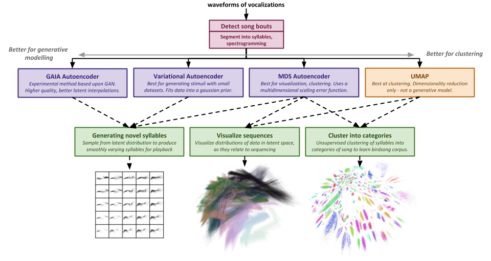
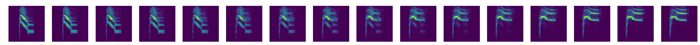
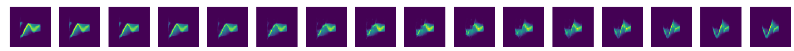

Animal Vocalization Generative Network (AVGN)
==============================

Tim Sainburg (PhD student, UCSD, Gentner Laboratory)

This is a project for taking animal vocalization audio recordings, and learning a generative model of segments of those vocalizations (e.g. syllables) using modern machine learning techniques. Specifically. This package will take in a dataset of wav files, segment them into units (e.g. syllables of birdsong) and train a generative model on those segments. The learned latent representations can be used to cluster syllables in an unsupervised manner, generate novel syllables, visualize sequences, or perform several other analyses.

---

### Overview of the package

#### an example interpolation of Bengalese finch song

#### an example interpolation of Cassin's vireo song

Documentation
------------
Examples of of different songbirds are located in the 'notebooks/birdsong' folder. There is no explicit documentation, but we will work on adding better docstrings to different functions (as we clean them up), and adding more notes to the example notebooks.

Currently there are two example birds - **Cassins vireo**, and **Bengalese finch**. The Cassin's vireo example dataset compares hand labelled syllables to syllable labels learned using out method, and thus uses the same segmentations as the manual method. The Bengalese finch is segmented automatically. I'm currently working on adding a few more species (both songbirds and other species).

To use these notebooks on your own dataset, clone this repo and copy the methods from one of the examples. You will need to change the parameters as well as parse date/time information in .

*Some of these functions use a lot of RAM (for example loading your whole dataset into RAM). If RAM is an issue for you, try using the data_interator from https://github.com/timsainb/GAIA*

Installation
------------

to install run python `setup.py install`

---

Data references
------------

Hedley, Richard (2016): Data used in PLoS One article “Complexity, Predictability and Time Homogeneity of Syntax in the Songs of Cassin’s Vireo (Vireo cassini)” by Hedley (2016). figshare. https://doi.org/10.6084/m9.figshare.3081814.v1

Katahira K, Suzuki K, Kagawa H, Okanoya K (2013) A simple explanation for the evolution of complex song syntax in Bengalese finches. Biology Letters 9(6): 20130842. https://doi.org/10.1098/rsbl.2013.0842  https://datadryad.org//resource/doi:10.5061/dryad.6pt8g

Katahira K, Suzuki K, Kagawa H, Okanoya K (2013) Data from: A simple explanation for the evolution of complex song syntax in Bengalese finches. Dryad Digital Repository. https://doi.org/10.5061/dryad.6pt8g

Arriaga, J. G., Cody, M. L., Vallejo, E. E., & Taylor, C. E. (2015). Bird-DB: A database for annotated bird song sequences. Ecological informatics, 27, 21-25. http://taylor0.biology.ucla.edu/birdDBQuery/

#### TODO
- rewrite functions and add docstrings
- make less RAM heavy
- add other animal vocalization datasets
- ...

------------

<small>Project based on the <a target="_blank" href="https://drivendata.github.io/cookiecutter-data-science/">cookiecutter data science project template</a>. #cookiecutterdatascience</small>

